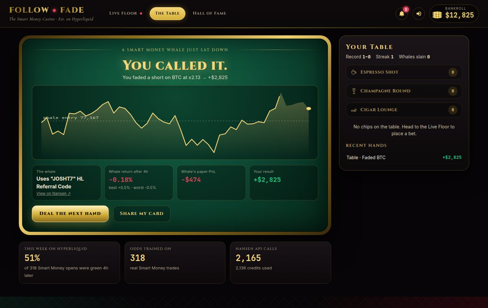
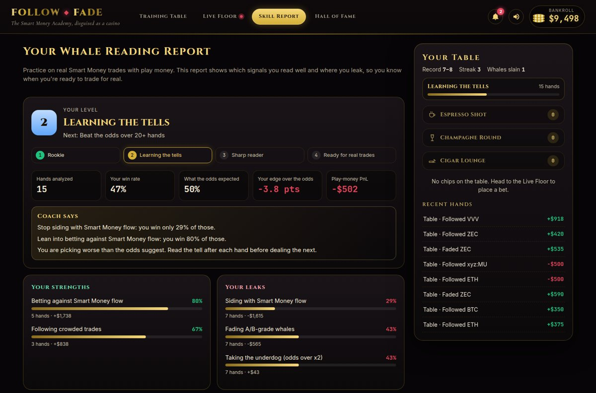
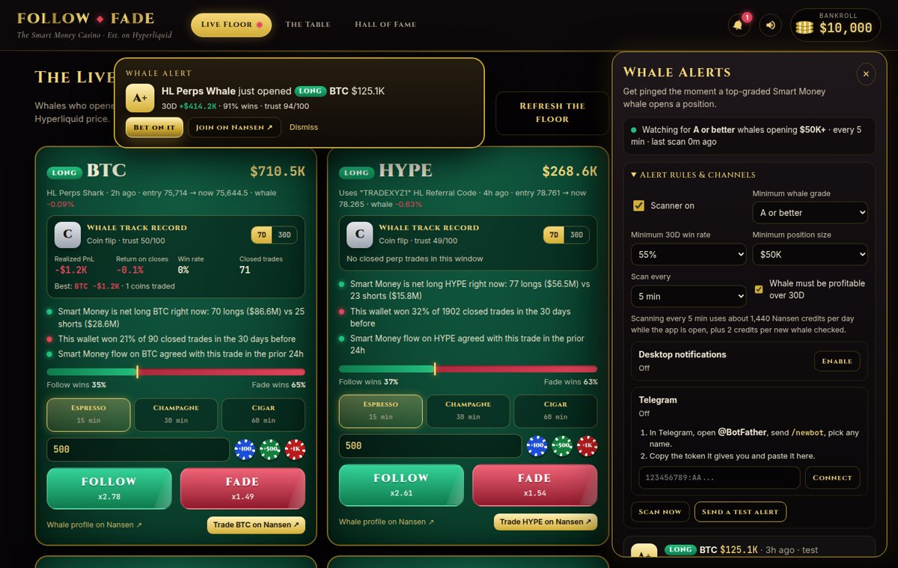
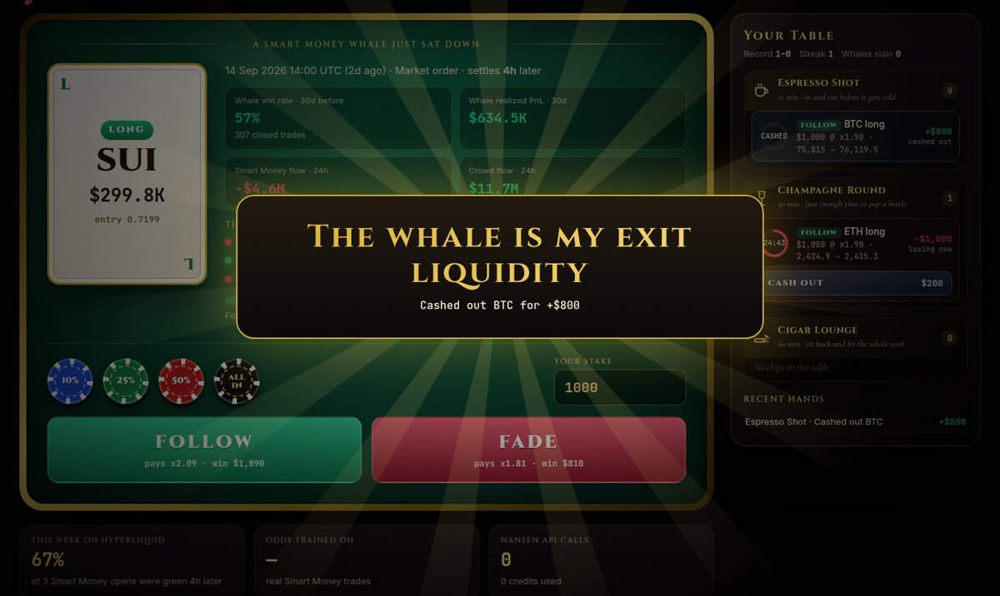
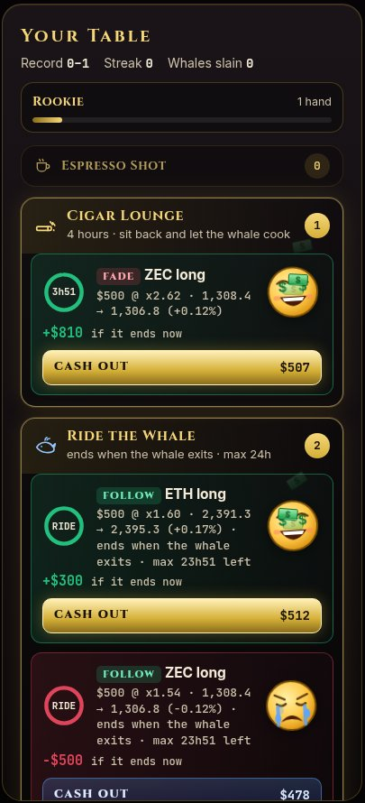
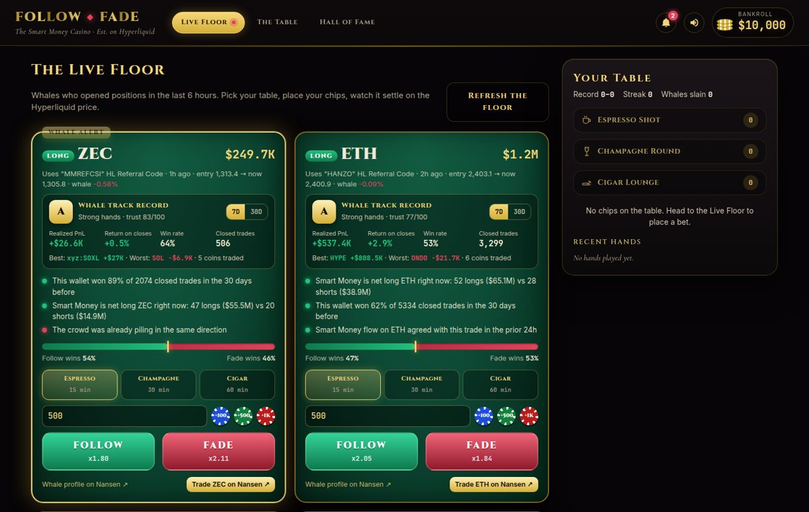
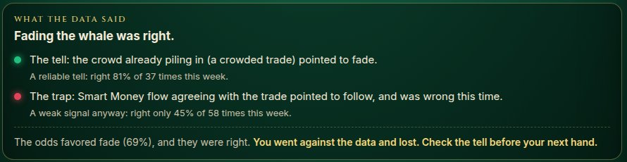

# FOLLOW or FADE

### The Smart Money Academy, disguised as a casino.

**Build measurable trading skill without risking capital.** Every hand is a real Hyperliquid trade opened by a Nansen Smart Money whale. You get $10,000 in play chips: follow the whale or fade it. **Nansen data sets the odds, the market settles the bet**, and after every hand the coach tells you which Nansen signal called it. Your **Trader Profile** scores seven named reading skills against what the odds expected of you, so "am I getting better at this?" has an answer. What you do with that skill — including trading for real on Nansen — is the next step, not the point.

**Train → Practice live → Trade for real on Nansen**

| 1. Training Table | 2. Live Floor | 3. Nansen |
|---|---|---|
| Replay this week's real whale trades, bet play money, and get a lesson on every hand | Bet on whales opening positions right now, with track records, trust grades and alerts | When your Trader Profile says you read these well, one click opens the market in Nansen's trading app |

Built for the Nansen Meridian Buildathon.

---



## Run it in under 5 minutes

Requirements: [Node.js 18+](https://nodejs.org). No `npm install`, no build step, zero dependencies.

**macOS / Linux**

```bash
git clone https://github.com/tonychdid/follow-or-fade.git
cd follow-or-fade
echo "NANSEN_API_KEY=your_key_here" > .env
npm start                   # then open http://localhost:3000
```

**Windows:** download the repo (Code → Download ZIP), unzip it and double-click `start.bat`. On first run it asks for your key and opens the browser.

**Time to first hand:** about 5 seconds after `npm start` (tested on a fresh copy with Node 18 and Node 22). Open http://localhost:3000, pick a nickname, and the Training Table deals a live Smart Money trade.

**Credits:** the first launch trains the odds on this week's trades in the background (about 450 Nansen credits over 5 minutes), then roughly 3 credits per training hand. On a small credit balance, add `CALIBRATION_SAMPLE=20` to `.env`.

**Troubleshooting:** port 3000 busy → add `PORT=3001` to `.env`. "No Smart Money trades available" → check the key and your credit balance at https://app.nansen.ai/api.

No key yet? Skip the `.env` step and the app runs in **demo mode**: Nansen-shaped sample wallets on top of real Hyperliquid prices, with a `DEMO DATA` badge.

**Host it for everyone:** see [DEPLOY.md](DEPLOY.md) (Railway, about 15 minutes, with a daily credit cap and admin-only alert settings).

## How it plays

The app opens on the **Training Table**.

| Mode | What happens |
|---|---|
| **Training Table** (replay) | You're dealt a real Smart Money position open from the last 7 days (coin, side, size, entry). The wallet is hidden. You see the Nansen intel, the model's probability and the odds. Stake, pick **Follow** or **Fade**, and the hand is **judged on the whale's real exit**: the app follows the whale's own position until it's fully closed (size-weighted exit of every reduction), capped at 48h and marked to market if they're still holding. The reveal shows the price path up to the exit, how long the whale held, the wallet and your payout. **What the data said:** after every hand the coach names *the tell* (the Nansen signal that called it) and *the trap* (the one that misled), with how reliable each signal was this week across hundreds of resolved Smart Money trades. |
| **Trader Profile** | Every bet stores the Nansen signals you acted on. Only decisions that match how whales actually trade count: training hands, 4-hour and Ride the Whale bets (15-minute bets are just for fun). Seven named skills are each scored **0–100 on your edge over what the odds expected of you** — 50 means you read those hands exactly as well as the data did, and small samples are shrunk toward 50 so three lucky hands don't read as mastery: 🧠 Smart Money Detection, 🐋 Follow Accuracy, 🧨 Fade Accuracy, 👀 Crowd Reading, 🎯 Entry Timing, ⚡ Short-Term Trades, 📈 Long-Term Trades. Every score is computed from a field the bet actually stored; there is deliberately **no "Risk Management" score**, because the game measures nothing that would honestly support one. Below that: your strongest skill, your biggest leak, a recommended next drill, **10 tracked patterns** (following A/B-grade whales, fading crowded trades, siding with Smart Money flow, taking underdogs…) and coach advice. The level ladder — *Rookie → Apprentice → Whale Reader → Smart Money Hunter → Market Operator* — is earned **by beating the odds, never by playing more hands**: a volume ladder would reward clicking, which is the opposite of what this teaches. |
| **Live Floor** | Smart Money opens from the last 6 hours whose whale **still holds the position** (checked on Hyperliquid every minute, with "trimmed X%" when they have cut size), with where Smart Money is positioned on that coin right now. **Ride the Whale** is the only lane: your bet ends **when that whale closes the position** (backstop 72h, `RIDE_MAX_HOURS`), tracked live from their Hyperliquid fills, and you can **cash out at fair value any time**. Fixed 15-minute and 4-hour tables were removed — a clock measures short-term price noise, not whether the whale was right. Cashing out early keeps being followed: once the whale is actually out, the game tells you what holding would have paid, so exit timing becomes something you can learn. Each whale shows a **7D and 30D track record** from Nansen (realized PnL, return, win rate, best and worst coin) and a **trust grade** (A+ to F). One click opens that market on **Nansen**, where the data came from. No link on this site is a referral link and nothing here earns a commission. |
| **Your Table** (always on screen) | Only your open live bets, grouped by table, with countdown rings and a live meme face: a money-printing face when you are winning and a crying face when you are losing, getting more intense as the bet moves. Settled bets move to Recent hands. |
| **Cash Out** | End a live bet early. The offer is the bet's fair value: stake × odds × the probability you are still winning at the bell, starting from the probability the odds were priced at and updated with how far price has moved, the time left and the coin's current 1-minute volatility on Hyperliquid, with no fee at all: cashing out the moment you bet returns exactly your stake. Cash out in profit: *"The whale is my exit liquidity."* Cash out at a loss: *"Cashing out before the whale gets rekt."* |
| **Whale Alerts** (bell icon) | A background scanner checks Nansen Smart Money perp opens every few minutes, grades each whale's 7D and 30D track record, and alerts you when a top whale opens a trade. Default rules: grade A or better, 55%+ win rate, profitable over 30D, $50K+ position, and **3+ coins traded in 7D and 5+ in 30D** so win rates can't be inflated by one-coin wallets. **Specialists** are the exception: a whale trading only 1–2 coins still gets through, tagged SPECIALIST, if the coin they're opening is one of their main coins (40%+ of their closes) with $25K+ realized profit and a 3%+ return on it over 30D, and no losing week on it. You get a sound, an on-screen alert, optional desktop notifications and optional **Telegram** messages. Each alert has **Open full card** (jumps to that whale's card, pinned at the top of the Live Floor) and **See it on Nansen** (opens that market where the data came from). After an alert, the app keeps reading that whale's Hyperliquid position and sends an **add alert** when they grow the position by 50%+ (conviction rising), a **trim alert** when they cut 25%, 50% or 75% and an **exit alert** when they fully close (with exit price and the whale's return), so nobody following them gets left in the trade. Every Telegram alert carries three buttons: **🔄 Re-check the numbers** (rewrites that same message with the price then versus now, how far it has moved for or against the trade since the alert, the current odds, fresh tells and whether the whale is still in, trimmed or out), **📊 Full whale card** and **🔎 See it on Nansen**. On the site each whale card has its own **↻ Re-check** button, so one whale can be re-priced without refreshing the whole floor; arriving from an alert link re-checks automatically and shows what changed since the alert. Telegram alerts link straight to that whale's full card on the Live Floor (position, 7D/30D track record, the dealer's tells, Smart Money positioning and, for stocks, the Nansen Agent insider brief). |
| **The front door** | The first thing a visitor reads is the hand they are about to play — *"A Smart Money whale just opened a $52.6K LONG on ENA. Do you FOLLOW or FADE?"* — with the real coin, side and size pulled from the deck (`GET /api/preview`). Nothing is invented: if the deck is still warming up, the line stays generic rather than showing a made-up trade. |
| **Challenge a friend** | After any training hand, "Challenge a friend" mints a link that deals **that exact whale** to whoever opens it — same size, same tells, same odds — and a card for X that shows the whale and the call you made but **never the result**. They have to make the call to find out. When they do, their reveal says how the two of you read it: *"Maya faded, you followed — you read it better."* |
| **If a trader objects** | Wallet addresses, third-party labels and derived statistics are published under legitimate interests, which carries an unconditional right to object. A trader writes in, proves control of the address by signing a message, and the address goes on a permanent exclusion list: it is dropped from the live floor, the training pool, the pre-built deck, stored alerts, live watches, shared challenge links and anyone's open bets, and never returns on a later data refresh. There is deliberately **no self-service removal button** — an unverified one would let any visitor blank the game by excluding the whales it shows, and a public "is this address excluded?" check would publish who had asked to be hidden. |
| **No paid promotion** | This site carries **no referral links, no affiliate codes and no tracking parameters**, and earns nothing from any link on it. Links to Nansen are plain links to a market page or a wallet profile so you can check the data yourself. That is a deliberate choice: promoting a crypto trading venue for commission to a French or EU audience engages advertising rules for digital-asset services that a small educational project should not be anywhere near. |
| **Leaving the game** | Every link that opens a real trading venue goes through one confirmation first. It is a **disclosure, never guidance**: the game is educational and played with valueless chips, nothing on the site is advice or a signal, the venues are unaffiliated third parties, and any decision taken beyond the site — with the loss or cost that may follow — is the player's alone. It deliberately does **not** tell anyone how to configure a trading account; naming a leverage or a margin mode would itself be advice. Telegram alerts carry the same disclosure in the message, since that button leaves for a real venue directly. |
| **Hall of Fame** | Ranked on **net profit**, not bankroll: every reload after going broke is $10,000 the house staked you, and it counts against your total, so going all-in forever can't buy a place on the board. A player qualifies after **3 settled hands** (`BOARD_MIN_BETS`): net profit alone would let one lucky all-in top the table, and since a new player costs nothing to create, a handful of throwaway identities shoving once each would otherwise fill every slot with coin flips. Shows reloads, win rate, best streak and **whales slain** (correct fades of trades the model favored). |
| **Share card** | One-click PNG plus a prefilled X post. |

| | |
|---|---|
|  |  |
|  |  |
|  |  |

Go below $10 and you're **REKT**: the bankroll resets and a bust is recorded.

The theme is a luxury casino, with sound effects synthesized in the browser (Web Audio, no audio files) and a mute button in the header.

---

## Why bets are judged on the whale's exit

We measured it. Of 150 recent Smart Money position opens, **only 11% were fully closed within an hour**. Among the positions that did close, the typical hold was about 13 hours, and half were still open when we checked (typically 1.8 days after opening). Judging a whale's call on a 15-minute price move mostly measures noise. So training hands are judged on the whale's real exit, the Live Floor is **Ride the Whale only** (the fixed 15-minute and 4-hour tables were removed — a clock measures price noise, not whether the whale was right), and the odds engine is calibrated on the same target. The sidebar shows the live median hold across this week's resolved trades.

## Reading the table: what the colours mean

A trading table hands the same two colours three different jobs, and that is how players misread it. This one keeps them separate:

| Colour | Means | Where you see it |
| --- | --- | --- |
| **Green / red** | **direction and money, nothing else** | LONG / SHORT badges, P&L, win rates, realized return, Smart Money and crowd flow |
| **Violet `#a78bfa`** (filled dot) | this tell **favors FOLLOW** | the dealer's tells, the odds bar, the FOLLOW button |
| **Orange `#fb923c`** (hollow ring) | this tell **favors FADE** | the dealer's tells, the odds bar, the FADE button |
| **Gold** | the house voice: headings, your result, the tell that called the hand | throughout |

The reason is specific. A red FADE button reads as "go short" — but fading a whale's **short** means going **long**, so the colour said the opposite of the action. And a green tell on a short position read as "this position is winning" when it actually meant "this points to following". Money colours now only ever mean money.

The tells are also **filled vs hollow**, not colour alone, so the distinction survives colour blindness and greyscale screenshots.

## How Nansen data drives the game

Nansen data decides the odds and the pool of trades.

```
Smart Money perp trades ──► the pool of playable trades (HIP-3 markets too: GOLD, NVDA…) (who opened what, when, at what price)
        │
        ├─ Wallet perp PnL summary (30 days BEFORE the trade) ─► win rate, closed trades, realized PnL
        ├─ Perp screener, Smart Money cohort (24h before)     ─► did Smart Money flow agree?
        ├─ Perp screener, all traders (24h before)            ─► was the trade already crowded? funding?
        ▼
  Odds engine (logistic model)  ──► P(follow wins) ──► fair decimal odds (no house edge)
        ▲
        └─ self-calibrates hourly on this week's resolved Smart Money trades (judged on the whale's exit)
Hyperliquid public fills + candles ──► follow each whale's position to its real exit and settle every bet
```

- **Two questions, two entries:** the Training Table asks *was the whale right?* and deals the trade at the whale's own entry. The Live Floor asks *is it still worth following now?* and uses today's price (betting from the whale's old entry would let players bet on a result that is already partly known). Live odds include how far the whale has already moved (a late-entry weight that starts at zero and is learned from settled live bets), and settled bets show your result next to the whale's.
- **Point-in-time, no look-ahead:** every feature uses only data from *before* the trade was opened.
- **Server-side outcomes:** the result is computed on the server and only revealed after the bet, so you can't peek in the network tab.
- **No house edge:** the payout is the fair odds (1 ÷ probability). This is a learning game with play money, so nothing is skimmed on bets or on cashing out.
- **One horizon, one price:** the model predicts whether following a whale wins *at the whale's exit*, and that is now the only bet on the floor, so the price needs no horizon adjustment. The `RIDE_MAX_HOURS` backstop is 72h because that is where the gain stops: measured over a 7-day window on 66 real Smart Money positions, a 24h cap let the whale decide 51% of bets, 48h decided 64%, 72h decided 73% — and 96h, 120h and 168h all decided the same 73%, the rest being multi-week holders.
- **Live-only signals:** on the Live Floor two extra signals adjust the probability — how far the whale has already moved (your entry versus theirs) and how Smart Money's money is positioned on that coin right now (long dollars vs short dollars). Both are learned from settled live bets, and neither touches the Training Table odds, which stay strictly point-in-time.
- **Self-calibrating odds:** each hour the app resolves a sample of this week's Smart Money opens (on the whale's real exit, max 48h) and refits the model, with an L2 pull toward a sensible prior so small samples stay stable. The sidebar shows how many trades the odds were trained on and what share of Smart Money opens were actually in profit when the whale exited.

### Nansen endpoints used

| Endpoint | Credits | Used for |
|---|---|---|
| `POST /api/v1/smart-money/perp-trades` | 5 | Round pool (7d), Live Floor feed (6h) |
| `POST /api/v1/profiler/perp-pnl-summary` | 1 | Wallet track record before the trade (odds), plus 7D and 30D whale track record and trust grade (live) |
| `POST /api/v1/smart-money/perp-trades` (1h lookback) | 5 | Whale Alerts scanner (every 2–30 min, configurable) |
| `POST /api/v1/perp-screener` (`trader_type: sm` and `all`) | 1 | Smart Money vs crowd net flow, funding, and current Smart Money long/short positioning in dollars (a live-only signal in the odds) |
| `POST /api/v1/agent/expert` (Nansen Agent) | 750 | **Insider Pick of the Day:** once per UTC day, screens every stock listed on Hyperliquid for insider buying and picks the best setup |
| `POST /api/v1/agent/fast` (Nansen Agent) | 200 | **Insider check** on stock whale cards and in Telegram alerts: insider trades, ownership, earnings, valuation |

Credit use is kept low with caching: whale and market data are cached per hour, and the Live Floor feed for 15 minutes. The sidebar shows real API calls and credits used.

---

## Configuration (`.env`)

| Var | Default | Meaning |
|---|---|---|
| `NANSEN_API_KEY` | – | Your key from https://app.nansen.ai/api |
| `PORT` | 3000 | Web port |
| `MAX_HOLD_HOURS` | 48 | Training hands are judged on the whale's real exit, capped at this many hours |
| `MIN_HOLD_MINUTES` | 0 | Drop training hands whose whale closed faster than this. **Off by default** — scalpers are in. Measured on 70 live Smart Money whales (Sep 2026), a 60-minute floor discarded three quarters of the cohort, including its most consistent members. Quality is judged on the wallet's record instead (see *Which whales qualify* below) |
| `PUSH_BAND_PCT` | 0.2 | Whale results smaller than ±this % are a push (stake back) on training hands, Ride the Whale and the Insider Pick, and are left out of odds training |
| `RIDE_MAX_HOURS` | 48 | Ride the Whale bets end when the whale closes, capped at this many hours |
| `CALIBRATION_SAMPLE` | 60 | Trades resolved per hourly calibration run |
| `DEMO` | 0 | `1` forces demo data |
| `AGENT_DAILY_CREDITS` | `1600` | Daily Nansen credits for the Research Desk (Nansen Agent). `0` turns it off |
| `DAILY_CREDIT_CAP` | none | Max Nansen credits per UTC day. Above it the app serves cached data and demo whales, and pauses odds training and alerts |
| `PUBLIC` | 0 | `1` for a public deployment: per-IP rate limits, alert rules and Telegram become admin-only |
| `ADMIN_TOKEN` | none | With `PUBLIC=1`, open `/?admin=TOKEN` once to manage alerts |
| `DATA_DIR` | `data` | Where bankrolls, bets and the leaderboard are stored (mount a volume here when hosting) |
| `BOARD_MIN_BETS` | `3` | Settled hands a player needs before appearing on the Hall of Fame |
| `ALERT_LOOKBACK_HOURS` | `6` | How far back each alert scan reads the Nansen feed (same 5-credit cost at any window) |
| `ALERT_MAX_AGE_MIN` | `240` | How old a trade may be and still earn its first alert |
| `ALERT_MAX_PER_SCAN` | `5` | Most alerts one scan may send, newest first (the rest wait for the next scan) |
| `WHALE_COOLDOWN` | `10` | Hands that must pass before the same whale can be dealt to a player again |
| `ROSTER_DAYS` | `7` | How often the whale pool is re-assessed: new whales in, non-performers out, with a written diff. `0` turns it off. Costs ~267 Nansen credits per run (~38/day at weekly) |
| `ROSTER_LOOKBACK_HOURS` | `168` | The window the re-assessment reads to decide who is "in the pool" |
| `ROSTER_MIN_USD` | `25000` | Smallest position that counts as being active in the pool |
| `EARLY_PUMP_PCT` | `0.15` | How big a move has to be, within the horizon, to count as one worth being early to. 15% is the top 15% of all measured opportunities |
| `EARLY_CAPTURE_PCT` | `0.5` | How much of that move they must keep. The median trader keeps 26%, so half is top-quartile behaviour |
| `EARLY_HORIZON_HOURS` | `48` | Window after entry for both the move and the return. 24h and 72h select almost the same wallets |
| `EARLY_MIN_FINDS` | `4` | Good early calls needed in 30 days — four, not one, is what separates skill from a lucky week |
| `EARLY_MIN_CONVERT` / `EARLY_MIN_COINS` / `EARLY_MIN_DAYS` | `0.4` / `2` / `3` | Conversion rate, and spread across coins and days, so one hot streak on one coin cannot qualify |
| `EARLY_FEW_MIN_FINDS` / `EARLY_FEW_MIN_CONVERT` | `1` / `0.5` | The second route: how few early calls are enough, and how many of their chances they must have converted |
| `EARLY_PROVEN_MIN_SCORE` / `_ROI` / `_WIN` / `_CLOSED` | `75` / `0.05` / `0.65` / `50` | How good the 30-day record has to be for that second route to open |
| `FAST_CLOSES_PER_DAY` | `3` | Closing fills a day above which the Live Floor treats a wallet as one that would crowd it. **Not** the same scale as `SCALPER_TRADES_PER_DAY`: fills are read aggregated by time, so this runs ~10x lower. Calibrated against Nansen's own flag on 70 wallets (74% agreement) |
| `CLASS_WARM_PER_BUILD` | `10` | Wallets classified in the background per Live Floor build, so a fresh deployment fills its map in minutes instead of waiting for the weekly roster |
| `PRINTER_MIN_USD` / `PRINTER_MAX_USD` | `15000` / `50000` | The size band for a printer. **Never set the minimum lower**: below $15K is noise |
| `PRINTER_MIN_TRADES` / `PRINTER_MIN_WIN` / `PRINTER_MIN_RET` | `8` / `0.55` / `0.01` | Sample, win rate and typical return per closed trade a printer must beat |
| `CLASS_WINDOW_DAYS` | `30` | History read from Hyperliquid when classifying a wallet |
| `LIVE_LOOKBACK_HOURS` | `96` | How far back the Live Floor looks for whales **still in** a position. Was 6h, which silently asked a different question — who *opened* recently — and handed the floor to the fastest wallets |
| `LIVE_FLOOR_SLOTS` / `LIVE_FLOOR_PER_COIN` | `8` / `2` | Cards on the floor, and the most from any one coin. One card per wallet is fixed |
| `SCALPER_MAX_MEDIAN_HOURS` / `SCALPER_MIN_SHARE_UNDER_1H` | `4` / `0.5` | What makes a whale a SCALPER: a typical position closed inside four hours, or half of them inside one. Measured on real round trips |
| `SCALPER_TRADES_PER_DAY` | `20` | A wallet averaging this many closed trades a day over 30D is labelled **SCALPER** on cards and alerts. The tag is descriptive, not a quality judgement — it warns you the position may not last long |
| `MAX_PLAYERS` | 100000 | Cap on stored players; above it, visitors who never placed a bet are pruned first |
| `MAX_EXCLUDED` | 5000 | Cap on the trader exclusion list |
| `ADMIN_TOKEN` | none | Required in public mode. **Set it and the admin routes fail closed**, even if `PUBLIC` is ever missing |
| `PUBLIC_URL` | none | Your public URL, used for X / social preview cards |

## Which whales qualify

Not every Smart Money wallet is worth watching, so a wallet has to clear a set of quality gates before
the app will deal it as a hand or fire an alert about it. The gates are edited in the app under
**bell → Alert rules & channels** and stored in `data/alertcfg.json`; the defaults below come from the
live distribution of 70 Smart Money whales measured in September 2026.

| Rule | Default | What it rejects |
|---|---|---|
| `minGrade` | `A` | Wallets whose trust grade is below this |
| `minWinRate` | `0.55` | Wallets winning less than 55% of their closed trades |
| `minClosed` | `20` | Wallets with too small a 30-day sample to judge |
| `minCoins7d` / `minCoins30d` | `3` / `5` | One-trick wallets with no breadth |
| `minSizeUsd` | `50000` | Positions too small to be a real conviction bet |
| `requireProfit30d` | `true` | Wallets that lost money over 30 days |
| `minRoi30d` | `0.02` | Wallets up in dollars but below a 2% return on closes — big size masking a thin edge |
| `requireProfit7d` | `true` | Wallets coasting on an old 30-day number while losing right now |
| `minPnlPerFee` | `3` | **Wash-trade guard.** Profit must be at least 3× fees paid. A wallet churning volume for rebates or points fails here |
| `minPnlPerTrade` | `10` | **Wash-trade guard.** At least $10 of profit per closed trade. Thousands of near-zero round-trips fail here |
| `requireCoinMajority` | `true` | Wallets carried by a single lucky coin — more than half the coins they traded must be profitable |

**Scalpers are included.** An earlier build excluded any whale who closed positions quickly, on the
assumption that fast hands were noise. Measuring the cohort showed the opposite: 53 of the 70 whales
close more than 20 trades a day, and 51 of those 53 were profitable over 30 days. The exclusion was
throwing away the most consistent traders in the set. They are now judged on their record like anyone
else, and carry a **SCALPER** tag on cards, popups, desktop notifications and Telegram so you know the
position may not last long (see `SCALPER_TRADES_PER_DAY` above).

Against the same 70-whale sample, the rules above pass **26 wallets (37%)**, 20 of them scalpers.

> Honest note: in that sample the two wash-trade guards (`minPnlPerFee`, `minPnlPerTrade`) excluded
> nobody — every wallet that cleared the other rules also cleared these. They are insurance against a
> wallet type that exists on Hyperliquid but did not appear in this cohort, not active filters today.

## Two kinds of trader the grade cannot see

The grade is built from win rate and realised return. That works, and it is blind in two specific
ways — so there are two extra ways into the pool, each measured rather than assumed.

### EARLY — in before the move, and still there at the end

Studied over **143 Smart Money wallets and 2,404 round trips** (Sep 2026), reading Hyperliquid fills
directly so every position could be rebuilt and re-priced.

The first number sets the bar for what counts as a move worth catching: the median entry has only
**5.2%** available to it within 48 hours, and the 90th percentile is 18.3%. So **15%** marks the top
15% of all opportunities.

The second number is the interesting one. Of the trades where a 10%+ move did follow the entry, the
**median trader captured 25.9% of it**. Most people who catch a pump sell a quarter of it and watch
the rest run. Keeping half or more is top-quartile behaviour, which is why the capture bar is 50%.

A wallet is EARLY when, over 30 days, it was early on **at least 4 moves of 15%+**, kept at least half
of each, converted at least 40% of the big moves it was in, across **2+ coins and 3+ separate days**,
and was profitable overall. **7 of 143 wallets (4.9%) qualify.**

Horizon is not doing the work: 24h gives 6 wallets and 72h gives 5, and every wallet in the 72h set is
in the 48h set.

**A second route, for traders who have not had four chances.** A wallet with only one or two early
calls still qualifies if it converted them **and** its 30-day record is exceptional: score 75+, a 5%+
return and a 65%+ win rate over 50+ closed trades. Measured, this admits **14 more wallets, every one
of them A+, returning 5–47% over 30 days** — and still turns away two excellent traders who were in
front of nine and twelve big moves and held two. Being a great trader is not the same as being early,
so both halves have to be true. Tooltips and Telegram say plainly when a tag rests on a small sample.

> This is what reopened the AVAX case. `0x2175ce7c…` opened within 0.1% of a three-day low before a
> **51.8%** run and kept 88% of it — one call in 30 days, but an **A+ record with a 47.2% return and an
> 80% win rate over 241 trades.** It now carries the tag, on the strength of the record rather than the
> pattern. A wallet with one lucky call and an ordinary record still does not.

> The trade that prompted this feature does not qualify, and that is the filter working. One wallet
> opened AVAX within 0.1% of a three-day low before a **51.8%** run — but it is their only such call in
> 30 days. One brilliant entry is not a track record, and the rule asks for four.

### PRINTER — too small for the whale floor, and printing anyway

Position sizes between **$15K and $50K**, at least 8 closed trades, a win rate of 55%+, a typical
return of 1%+ per closed trade, and profitable. 15 of the 143 wallets trade in that band; **4 clear
the bar.**

This one needed a change deeper than a rule. The size floor was asked of the **feed**, so a small
trader's positions never arrived at all and no rule further down could have saved them. The scanner
now asks for everything from the printer floor upward and applies the whale floor per trade — a
sub-floor trade is only looked at when the wallet is already a known printer or early finder, which is a
lookup in a map, not a Nansen call. The feed costs the same 5 credits at any floor.

### What they actually add

Both paths sit **after** the integrity gates — sample size, profitability, and both wash-trade guards
apply to everyone, with no exemptions — and **before** the return and recent-week bars, which is the
whole point: those are the rules that were turning these traders away. Among the 9 wallets that
qualify under either path, the ones admitted *only* by a new path include a wallet with an **89% win
rate over 6,531 trades**, rejected for a 1.58% return, and one with the best capture rate in the whole
study (79%), rejected for 1.50%.

Neither tag changes the grade. They describe a kind of edge the score cannot represent, and letting
them move a number already built from win rate and return would count the same record twice.

Classification runs inside the weekly roster and costs **no Nansen credits** — the entire 143-wallet
study spent 5, all of them on the Smart Money feed that produced the candidate list. It reads
Hyperliquid fills (one call per wallet, covering every trade they made) and candles (one series per
coin, reused). A wallet with more fills than the API will page through is left unclassified rather
than judged on a slice of its record.

Turn either path off with the switches in **bell → Alert rules & channels**, or with `allowEarly` /
`allowPrinter` in the config.

## The SCALPER tag was wrong on 80 of 85 whales

Worth writing down, because the mistake is easy to repeat.

The tag was derived from Nansen's `closed_trade_count / 30`. That field counts every closing **fill**,
not every position — so a trader who builds one position and scales out of it in sixty clips registers
sixty "closed trades". Measured against real round trips rebuilt from Hyperliquid fills, of the **85
wallets it tagged, 57 actually held longer than 12 hours and 42 longer than a day. Only 5 held under
an hour.**

Two the tag named:

| Whale | Nansen "closed trades" | Real round trips | Median hold | Under 1h |
|---|---|---|---|---|
| Token Millionaire | 979 | **9** | **9.7h** | 11% |
| Uses "RABBYWALLET" | 648 | **17** | **47.2h** | **0%** |

Both were tagged SCALPER, with a tooltip reading *"expect a short hold"*, on traders who hold for
days. That is not a cosmetic error — someone could cash a Ride the Whale bet early because of it.

**The tag now measures holding time**, from real round trips: a typical position closed inside four
hours, or half of them inside an hour. That takes it from 85 wallets to **13**, whose median holds run
from **4 minutes to 3.2 hours** with 29–71% closed inside the hour. The tooltip quotes the actual
figure instead of a rate.

Two things stayed separate on purpose. **Crowding** — what stops a handful of wallets taking every
card on the Live Floor — is about how often a wallet *opens*, not how long it holds, and still uses
closing-fill frequency. A wallet can open constantly and hold each position for days. And the roster
no longer writes Nansen's verdict over the measured one; it passes only the pace.

> Nothing about this changed which whales get alerts. `MIN_HOLD_MINUTES` only ever gated training
> hands and odds calibration — the alert path never referenced it. Whales like these were alerting
> before the scalper work and are alerting now; what changed is that they briefly wore a label that
> did not describe them.

## Why the Live Floor is not just the eight biggest trades

Letting scalpers back into the pool had a consequence nobody asked for: **every card on the floor was
a scalper.** Not a filter bug — arithmetic. The floor ranked strictly by size over a **6-hour** window,
and a wallet that opens twenty positions in six hours gets twenty chances at the top eight while a
wallet that opens one gets one.

Three things were wrong, and each was measured before it was changed:

1. **The window asked the wrong question.** Six hours finds whales who *opened* recently; the floor is
   meant to show whales who are *in* a position. For a wallet closing 300 times a day those are the
   same thing, and for one holding two days they are not — measured holds are p50 18h, p90 174h. At
   48h only **5** slower whales were still holding; at 96h, **19**. Now 96h. `holding()` already drops
   anyone who has closed, so nothing stale reaches the floor.
2. **The candidate pool was cut by size**, which is itself a filter against slower traders — they trade
   less often and often smaller, so they were removed before any diversity rule could see them. Part of
   the pool is now reserved for wallets known not to be fast.
3. **Nothing stopped one wallet taking several cards.** Now: one card per wallet, at most two per coin,
   and at most half the floor from fast wallets. Order is shuffled on a five-minute seed, so the floor
   rotates between visits without reshuffling under someone mid-read.

Before: 8 of 8 scalpers, 6 distinct coins. After: **4 of 8 scalpers, 8 wallets, 7 coins** — and a
commodity (`xyz:GOLD`) on the floor for the first time.

**The first version of this shipped broken, in a way only a cold start revealed.** All of it depended
on classifications the weekly roster writes, so on a fresh deployment — an empty volume — every rule
was inert and the floor looked exactly as it had before. Worse, the fallback meant to cover that case
counted opens from a list already de-duplicated to one row per wallet, so every count was 1 and the
test could never fire. Two fixes: the count now comes from the raw feed, and the floor warms its own
classifications in the background (free, Hyperliquid only, ten wallets per build, drawn from the whole
feed rather than the size-ranked candidates — otherwise the slower traders it exists to surface are
never scored and never reserved a slot). From a genuinely empty data directory the floor now reaches
**5 of 8 scalpers, 8 wallets, 7 coins within about two minutes**, and tightens to 4 of 8 once the
roster supplies Nansen's exact flag.

> A note on counting, because it caused a real bug: the classifier counts **round trips**, while
> Nansen's `closed_trade_count` counts every closing **fill**. A whale scaling out of one position in
> twenty fills is 1 by the first measure and 20 by the second. Comparing them against a threshold
> calibrated on the second flagged nobody as fast. The roster now hands the Nansen-derived pace to the
> classifier rather than letting it invent a second definition.

## The roster and the journal

Two things are written down that the game itself never reads. Both are admin-only.

**`/admin/roster.json?token=…`** — the whale pool as of the last assessment. Every wallet that opened a
qualifying-size position in the window, whether it clears the bar, and **when it does not, the first
rule it broke**. Plus the diff against the previous run: who entered, who left, and why.

The pool was always rolling — the feed is a 7-day sliding window, so a whale who stops trading falls
out by themselves and a new one is picked up the moment they appear. What was missing was the record
of it. Without a snapshot there is no way to see a good trader quietly degrade, and no way to tell
whether a rule change helped or merely churned the list.

Measured on a live run: **131 wallets seen, 47 qualifying (36%), 34 of them scalpers**, 267 credits,
61 seconds. The reasons the other 84 were left out:

| Rule they broke first | Wallets |
|---|---|
| 30D return under the minimum | 28 |
| Unprofitable over the last 7D | 13 |
| Unprofitable over 30D | 12 |
| Too few coins in 30D | 12 |
| Grade below the minimum | 9 |
| No closed trades in the last 7D | 7 |
| Fewer than half their coins profitable | 2 |
| Under the minimum closed trades | 1 |

**`/admin/journal.jsonl?token=…`** — append-only, one line per alert, never trimmed. `alerts.json`
keeps the last 200 and drops the rest, which is right for the screen and useless for any question
asked in weeks rather than hours. Each line carries the whale (address, grade, scalper flag, trades
per day, 30D and 7D records), the position (coin, side, size, the whale's fill), and — the field that
makes the file worth keeping — **`priceAtAlert`, the mark when the alert went out, which is the entry
a follower could actually have got**. The whale's own fill is already gone by then. Follow-up lines
(`exit`, `trim`, `add`) carry the exit price, the return and how long it was held, and point back at
the opening line through `parentId`.

Test alerts are journaled too, flagged `test: true`. A flagged row is easier to explain than a gap.

## Research Desk (Nansen Agent)

Hyperliquid lists stock perps (NVDA, INTC, SNDK…), and Smart Money whales trade them. The Research Desk adds Nansen Agent on top of the whale data:

- **Insider Pick of the Day** (top of the Live Floor): once a day, Nansen Agent in Expert mode screens every company ticker listed on Hyperliquid's builder markets for open-market insider buying, preferring filings reported in the last few business days, cross-checked with earnings and valuation. The card shows **where insiders got in** (average filing price, or an estimate from the Hyperliquid daily chart on the report dates), the price now versus the insiders, and how fresh the filings are. Players Follow or Fade over **1 week, 1 month or 6 months**: insiders can't sell for a profit within 6 months (SEC short-swing rule, Section 16(b)), and research on insider purchases finds most of the abnormal return builds over months, not hours.
- **Insider check** on every stock whale card: one tap shows what the company's insiders are doing and whether they point the same way as the whale.
- **Telegram alerts**: when a whale opens a stock perp, the alert includes the insider summary.

Answers are cached and shared by every player (12h per company, one screen per day), so the cost does not grow with traffic. `AGENT_DAILY_CREDITS` (default 1600) caps Agent spend separately from the game's `DAILY_CREDIT_CAP`, and always keeps room for the daily screen. All Agent output is labelled as AI research. Without an API key the desk shows sample research so the layout is still visible.

## Free beta and plans

The whole game is free during the beta (training, live bets, Trader Profile, in-app whale alerts). Telegram delivery and custom alert rules are the Premium side and stay admin-only on the public site while they are in private testing. The **Plans** page shows where the Academy is heading and links to a Telegram announcement channel (no email is collected and no payment is taken):

| Plan | What it unlocks |
|---|---|
| Basic (free) | Training Table, dealer's tells, Live Floor bets on all three tables, cash out, whale track records and trust grades, Trader Profile, challenge links, Hall of Fame, Trade on Nansen |
| Premium (paid, price announced at launch) | Everything in Basic plus real-time Telegram whale alerts, add / trim / exit position updates, graded-whale filters, the Insider Pick of the Day and Nansen Agent insider research |

The alert scanner runs once for everyone, so Premium alerts cost the same in Nansen credits whether 10 or 1,000 people receive them.

The **Premium** page describes the Telegram alert side (Premium) and the automated bet taker (Premium Plus). Both are **free, unfinished and invite-only**, and the page says so above everything else — there is no price, no plan, no checkout and no waiting list, so it makes no commercial offer and is always visible. The free-beta strip is still hidden unless `SHOW_PLANS=1`, because it implies a future paid tier. **If a paid tier is ever offered, re-gate the Premium page and fill in the Option B legal notice** — see DEPLOY.md. Access to the alert features is earned: testing places go to the top of the Hall of Fame leaderboard, and announcements are posted on X. There is no channel link, no signup and nothing to buy.

## Project layout

```
server.js            zero-dependency HTTP server and API routes
lib/nansen.js        Nansen client: cache, retry and Retry-After handling, call and credit accounting
lib/odds.js          features -> probability -> odds, plus calibration
lib/game.js          rounds, bets, bankroll, live bets, cash out, leaderboard
lib/alerts.js        Whale Alerts scanner, trust-grade rules, Telegram
lib/coach.js         post-hand lessons (tell and trap with weekly signal reliability) and the Trader Profile scores
lib/hyperliquid.js   public prices, candles, positions and fill history (whale exits, Ride the Whale, settlement)
lib/demo.js          demo data in Nansen response shapes
public/              the game UI (vanilla JS, no build): app.js, sfx.js (Web Audio), fx.js (particles)
public/legal.html      mentions légales (LCEN art. 1-1) — always served
public/legal-full.html risk notice, privacy notice and terms — served only when SHOW_LEGAL=1
public/fonts/        self-hosted typefaces (SIL OFL) so no visitor request reaches a third party
lib/excluded.js      traders who objected: consulted on every path that could show one
```

## Disclaimer

Play money only. Results in a game do not guarantee real trading results. Nothing here is financial advice.

## Telegram alerts (optional)

1. In Telegram, message **@BotFather**, send `/newbot` and follow the steps. Copy the token.
2. In the app, open the bell, then **Alert rules & channels → Telegram**. Paste the token and click **Connect**.
3. Open your new bot in Telegram, press **Start**, then click **I pressed Start** in the app. You'll get a test message.

The token is stored only on your machine in `data/alertcfg.json`, which is ignored by git.

## License

Copyright (c) 2026 the Follow or Fade authors. All rights reserved. You can read, download and run this code to evaluate it (including for the Nansen Meridian Buildathon), but you may not copy, redistribute, host or sell it without written permission. See [LICENSE](LICENSE).
